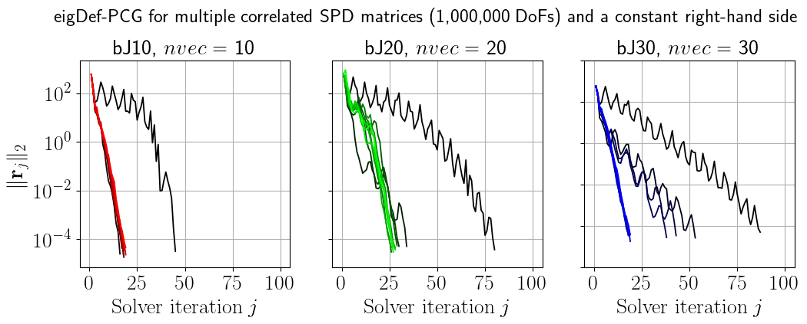

## MyRecycledKrylovSolvers.jl and MyPreconditioners.jl

##### Julia code of conjugate gradient (CG) algorithms with recycled Krylov subspaces for use in solves of sequences of linear systems with multiple sparse symmetric positive definite (SPD) matrices and/or right-hand sides.


Author: Nicolas Venkovic.

email: venkovic@gmail.com.


#### Dependencies:

 - Julia 1.4, Python 3.6.
 - Python packages: SciPy 1.4.1, PyAmg 4.0.0. 
 - Julia packages: LinearAlgebra.jl, PyCall.jl, SparseArrays,.jl, SuiteSparse.jl. 


#### Running examples: 

__Example 1: Multiple right-hand sides (one constant sparse SPD matrix)__

```bash
julia Example01_mrhs.jl
python Example01_mrhs.py
```

This example solves the linear systems  defined by `nsmp`=`10` samples of identically independently distributed (i.i.d.) . The `n`-by-`n` matrix  is the square of a random SPD tridiagonal matrix. We set `n`=`1_000_000` and use eigPCG (Stathopoulos and Orginos, 2010) with block Jacobi (bJ) preconditioners using different numbers (10, 20, 30) of diagonal blocks. The `nvec` least dominant (LD) eigenvector approximations of  extracted from the solve of the first system , which we store by columns in a matrix , are not  accurate enough. That is to say, generating an initial iterate for the second solve whose residual is orthogonal to the range of , e.g., , does not significantly accelerate the iterative solve. Thus, eigPCG is used incrementally (Stathopoulos and Orginos, 2010) for `nincr`=`3` solves. After every such solve, `nvec` additional (column) eigenvector approximations are appended to . Meanwhile, every initial iterate is set such that its residual is orthogonal to the range of the incrementally growing . Once `nincr` systems have been solved by eigPCG,  remains constant as it is used to generate the initial iterates of all the next systems solved by Init-PCG (Erhel & Guyomarc'h, 2000). The black curves in the figure below are the convergence histories of the first systems in the sequence. The convergence histories are made gradually more colorful throughout the sampled sequence. Note that the incremental eigPCG procedure enables a near 90% decrease of the number of required solver iterations when using a bJ preconditioner with 30 diagonal blocks (i.e., bJ30). The relative acceleration obtained is less significant when using less blocks.


This example works properly. However, this approach can be pushed to its limit by increasing the number of increments `nincr`. As the total number `nincr` * `nvec` of approximate eigenvectors increases,  tends to lose rank, which makes the computation of an initial iterate with an orthogonal residual more difficult. To alleviate this effect, one can orthogonalize the vectors in , at a computational cost O((`nincr` * `nvec`)^2 * `n`). See Stathopoulos and Orginos (2010) for further details.


__Example 2: Multiple correlated sparse SPD matrices (one constant right-hand side)__

```bash
julia Example02_mops.jl
python Example02_mops.py
```

This example solves the linear systems  defined by `nsmp`=`10` samples  of a random walk. The `n`-by-`n` matrix  is the square of a random SPD tridiagonal matrix. We set `n`=`1_000_000` and use eigPCG (Stathopoulos and Orginos, 2010) with block Jacobi (bJ) preconditioners using different numbers (10, 20, 30) of diagonal blocks. The `nvec` LD eigenvector approximations of  extracted from the eigPCG solve of  are stored by columns in a matrix . The range of  is then used as a deflation subspace for the iterative eigDef-PCG solve of  during which eigenvector approximations of  are extracted in a similar as in Stathopoulos and Orginos, (2010). These approximate eigenvectors are used to update  before the next eigDef-PCG solve. The eigDef-PCG algorithm is referred to as RR-LO-TR-eigDef-PCG in Venkovic et al. (2020). The black curves in the figure below are the convergence histories of the first systems in the sequence. The convergence histories are made gradually more colorful throughout the sampled sequence. Note that the incremental eigPCG procedure enables a near 75% decrease of the number of required solver iterations when using a bJ preconditioner with 30 diagonal blocks (i.e., bJ30). The relative acceleration obtained is less significant when using less blocks.



This example works properly. However, this approach can be pushed to its limit by (i) scaling the matrix increment of the random walk used to compute the matrices , (ii) decreasing the threshold of convergence on the backward error, (iii) increasing `nvec` or `spdim`, or (iv) increasing the dimension `n` of the problem. When doing so, the iterated residual  tends to lose it orthogonality with respect to the deflation subspace, in which case eigDef-PCG tends to not converge, and even becomes unstable. This problem, which was described in Saad et al. (1999), can be alleviated by setting  at the end of each solver iteration. This modification, which entails a computational cost O(`nvec` * `n`) at each iteration, does help, but does not always solve the problem.


#### Functions of MyRecycledKrylovSolvers.jl:

The default type `T`=`Float64` can be changed in MyRecycledKrylovSolvers.jl, in which case it should also be changed in MyPreconditioners.jl. Every function described underneath contains `jldoctest` scripting examples.

__cg.jl__:

- `cg` (`A`::SparseMatrixCSC{`T`}, `b`::Vector{`T`}, `x`::Vector{`T`}) 

  Computes iterates of CG (Saad, 2003).

  Inputs:

  `A`::SparseMatrixCSC{`T`}. Sparse CSC SPD `n`-by-`n` matrix. 

  `b`::Vector{`T`}. Right-hand side. 

  `x`::Vector{`T`}. Initial iterate. 

  Returns: `x`::Vector{`T`}, `it`::`Int`, `res_norm`::Vector{`T`}. 

  `x`::Vector{`T`}. Iterate at termination.

  `it`::`Int`. Number of iterations completed at termination.

  `res_norm`::Vector{`T`}. Norm of every iterated residual prior to termination. 

- `pcg` (`A`::SparseMatrixCSC{`T`}, `b`::Vector{`T`}, `x`::Vector{`T`}, `M`)

  Computes iterates of PCG (Saad, 2003).

  Inputs:

  `M`. SPD preconditioner. May be custom typed, or not. Must support the operation `M` \ `b` and return a `n`-dimensional Vector{`T`} as a means to apply the inverse preconditioner. 

  Returns: `x`::Vector{`T`}, `it`::`Int`, `res_norm`::Vector{`T`}. 

  

__initcg.jl__:

- `initcg` (`A`::SparseMatrixCSC{`T`}, `b`::Vector{`T`}, `x`::Vector{`T`}, `W`::Array{`T`,`2`}) 

  Computes iterates of Init-CG (Erhel & Guyomarc'h, 2000). Used to solve  with an SPD matrix  when a set of linearly independent vectors , , ... is known and such that Span{, , ...} is "approximately" invariant under the action of . Then an initial guess may be generated which is deflated of the solution projected onto the invariant subspace. Initializing a regular CG solve with such a deflated initial guess can result in improvements of the convergence behavior.

  Inputs:

  `A`::SparseMatrixCSC{`T`}. Sparse CSC SPD `n`-by-`n` matrix. 

  `b`::Vector{`T`}. Right-hand side. 

  `x`::Vector{`T`}. Initial iterate. 

  `W`::Array{`T`,`2`}. Matrix of `nvec` linearly independent `n`-dimensional vectors. 

  Returns: `x`::Vector{`T`}, `it`::`Int`, `res_norm`::Vector{`T`}. 

  `x`::Vector{`T`}. Iterate at termination.

  `it`::`Int`. Number of iterations completed at termination.

  `res_norm`::Vector{`T`}. Norm of every iterated residual prior to termination. 

- `initpcg` (`A`::SparseMatrixCSC{`T`}, `b`::Vector{`T`}, `x`::Vector{`T`}, `W`::Array{`T`,`2`}) 

  Computes iterates of Init-PCG (Erhel & Guyomarc'h, 2000). Used to solve  with an SPD matrix  and an SPD preconditioner  when a set of linearly independent vectors , , ... is known and such that Span{, , ...} is "approximately" invariant under the action of . Then an initial guess may be generated which is deflated of the solution projected onto the invariant subspace. Initializing a regular PCG solve with such a deflated initial guess can result in improvements of the convergence behavior.

  Inputs:

  `M`. SPD preconditioner. May be custom typed, or not. Must support the operation `M` \ `b` and return a `n`-dimensional Vector{`T`} as a means to apply the inverse preconditioner. 

  Returns: `x`::Vector{`T`}, `it`::`Int`, `res_norm`::Vector{`T`}. 

  

__defcg.jl__:

- `defcg` (`A`::SparseMatrixCSC{`T`}, `b`::Vector{`T`}, `x`::Vector{`T`}, `W`::Array{`T`,`2`}) 

  Computes iterates of Def.-CG (Saad et al., 2000). Used to solve  with an SPD matrix  when a set of linearly independent vectors , , ... is known such that Span{, , ...} is "approximately" invariant under the action of . The sequence of iterates of Def-CG is equivalent to a post-processed sequence of the regular CG solve of a deflated version of the linear system, with guaranteed decrease of the condition number. Remark: if Span{, , ...} is exactly invariant under the action of , one should use Init-CG instead of Def-CG because both algorithms would then have equally positive impacts on convergence, but Def-CG requires an additional computational cost at every solver iteration.

  Inputs:

  `A`::SparseMatrixCSC{`T`}. Sparse CSC SPD `n`-by-`n` matrix. 

  `b`::Vector{`T`}. Right-hand side. 

  `x`::Vector{`T`}. Initial iterate. 

  `W`::Array{`T`,`2`}. Matrix of `nvec` linearly independent `n`-dimensional vectors.

  Returns: `x`::Vector{`T`}, `it`::`Int`, `res_norm`::Vector{`T`}. 

  `x`::Vector{`T`}. Iterate at termination.

  `it`::`Int`. Number of iterations completed at termination.

  `res_norm`::Vector{`T`}. Norm of every iterated residual prior to termination. 

- `eigdefcg` (`A`::SparseMatrixCSC{`T`}, `b`::Vector{`T`}, `x`::Vector{`T`}, `W`::Array{`T`,`2`},  `spdim`::`Int`) 

  Computes iterates of RR-LO-TR-Def-CG (Venkovic et al., 2020), here referred to as eigDef-CG. Works as a combination of eigCG and Def-CG. The linear solve is deflated as in Def-CG, and approximate least dominant eigenvectors of  are computed throughout the solve in a similar way as in eigCG. This algorithm is an alternative to the incremental eigCG algorithm when solving for a sequence of systems  with a constant SPD matrix  and different right-hand sides . This algorithm should be the method of choice when solving a sequence of linear systems of the form  with correlated SPD matrices , , ... Examples are shown in the `jldoctest` for each type of problem.

  Inputs:

  `spdim`::`Int`. Maximum dimension of the eigen-search space. Must be such that `spdim` > `2` * `nvec`.

  Returns: `x`::Vector{`T`}, `it`::`Int`, `res_norm`::Vector{`T`}, `W`::Array{`T`,`2`}.

  `W`::Array{`T`,`2`}. `nvec`approximate LD column eigenvectors of `A`.

- `defpcg` (`A`::SparseMatrixCSC{`T`}, `b`::Vector{`T`}, `x`::Vector{`T`}, `W`::Array{`T`,`2`})

  Computes iterates of Def.-PCG (Saad et al., 2000). Used to solve  with an SPD matrix  and an SPD preconditioner , when a set of linearly independent vectors , , ... is known such that Span{, , ...} is "approximately" invariant under the action of . The sequence of iterates of Def-PCG is equivalent to a post-processed sequence of the regular CG solve of a deflated and split-preconditioned version of the linear system, with guaranteed decrease of the condition number. Remark: if Span{, , ...} is exactly invariant under the action of , one should use Init-PCG instead of Def-PCG because both algorithms would then have equally positive impacts on convergence, but Def-PCG requires an additional computational cost at every solver iteration.

  Inputs:

  `M`. SPD preconditioner. May be custom typed, or not. Must support the operation `M` \ `b` and return a `n`-dimensional Vector{`T`} as a means to apply the inverse preconditioner. 

  Returns: `x`::Vector{`T`}, `it`::`Int`, `res_norm`::Vector{`T`}.

- `eigdefpcg` (`A`::SparseMatrixCSC{`T`}, `b`::Vector{`T`}, `x`::Vector{`T`}, `M`, `W`::Array{`T`,`2`},  `spdim`::`Int`) 

  Computes iterates of RR-LO-TR-Def-PCG (Venkovic et al., 2020), here referred to as eigDef-PCG. Works as a combination of eigPCG and Def-PCG. The linear solve is deflated as in Def-PCG, and approximate least dominant right eigenvectors of  are computed throughout the solve in a similar way as in eigPCG. This algorithm is an alternative to the incremental eigPCG algorithm when solving for a sequence of systems  with constant SPD  and , and different right-hand sides . This algorithm should be the method of choice when solving a sequence of linear systems of the form  with correlated SPD matrices , , ... Examples are shown in the `jldoctest` for each type of problem.

  Returns: `x`::Vector{`T`}, `it`::`Int`, `res_norm`::Vector{`T`}, `W`::Array{`T`,`2`}.

  `W`::Array{`T`,`2`}. `nvec`approximate LD column right eigenvectors of `M`^`-1` * `A`.

  

__eigcg.jl__:

- `eigcg` (`A`::SparseMatrixCSC{`T`}, `b`::Vector{`T`}, `x`::Vector{`T`}, `nvec`::`Int`, `spdim`::`Int`) 

  Computes iterates of eigCG (Stathopoulos & Orginos, 2010). Used at the beginning of a solving procedure of linear systems  with a constant SPD matrix , and different right-hand sides . eigCG may be run once (or incrementally) to generate approximate least dominant eigenvectors of . These approximate eigenvectors are then used to generate a deflated initial guess with the Init-CG algorithm. Incremental eigCG should be used when the solve of the first system ends before accurate eigenvector approximations can be obtained by eigCG, which then limits the potential speed-up obtained for the subsequent Init-CG solves. See Example for typical use and implementation of the Incremental eigCG algorithm (Stathopoulos & Orginos, 2010).

  Inputs:

  `A`::SparseMatrixCSC{`T`}. Sparse CSC SPD `n`-by-`n` matrix. 

  `b`::Vector{`T`}. Right-hand side. 

  `x`::Vector{`T`}. Initial iterate. 

  `nvec`::`Int`. Number of wanted approximate eigenvectors. Typically, `nvec` << `n`.

  `spdim`::`Int`. Maximum dimension of the eigen-search space. Must be such that `spdim` > `2` * `nvec`.

  Returns: `x`::Vector{`T`}, `it`::`Int`, `res_norm`::Vector{`T`}, `W`::Array{`T`,`2`}.

  `x`::Vector{`T`}. Iterate at termination.

  `it`::`Int`. Number of iterations completed at termination.

  `res_norm`::Vector{`T`}. Norm of every iterated residual prior to termination. 

  `W`::Array{`T`,`2`}. `nvec`approximate LD column eigenvectors of `A`.

- `eigpcg` (`A`::SparseMatrixCSC{`T`}, `b`::Vector{`T`}, `x`::Vector{`T`}, `M`, `nvec`::`Int`, `spdim`::`Int`) 

  Computes iterates of eigPCG (Stathopoulos & Orginos, 2010). Used at the beginning of a solving procedure of linear systems A xs = bs with
constant SPD matrix A and SPD preconditioner M, and different right-hand sides . eigPCG may be run once (or incrementally) to generate approximate least dominant right eigenvectors of . These approximate eigenvectors are then used to generate a deflated initial guess with the Init-PCG algorithm. Incremental eigPCG should be used when the solve of the first system ends before accurate eigenvector approximations can be obtained by eigPCG, which then limits the potential speed-up obtained for the subsequent Init-PCG solves. See Examples for typical use and implementation of the Incremental eigPCG algorithm (Stathopoulos & Orginos, 2010).
  
Returns:
  
`W`::Array{`T`,`2`}. `nvec`approximate LD column right eigenvectors of `M`^`-1` * `A`.
  
  

#### Functions of MyPreconditioners.jl:

The default type `T`=`Float64` can be changed in MyPreconditioners.jl.

- `BJPreconditioner` (`nb`::`Int`, `A`::SparseMatrixCSC{`T`}) 

  Prepares a block Jacobi preconditioner with `nb` diagonal blocks.

  Returns: `M`::BJop.

  `M`::BJop. BJ preconditioner. Supports the operation `M` \ `b` and return a `n`-dimensional Vector{`T`} as a means to apply the inverse preconditioner. 

- `Chol32Preconditioner` (`A`::SparseMatrixCSC{`T`}) 

  Prepares a Cholesky factorization of `Float32`(`A`).

  Returns: `M`::SuiteSparse.CHOLMOD.Factor{`T`}.

  `M`::SuiteSparse.CHOLMOD.Factor. Cholesky preconditioner of `Float32`(`A`). Supports the operation `M` \ `b` and return a `n`-dimensional Vector{`T`} as a means to apply the inverse preconditioner. 

- `Chol16Preconditioner` (`A`::SparseMatrixCSC{`T`}) 

  Prepares a Cholesky factorization of `Float16`(`A`).

  Returns: `M`::PyObject <`n`x`n` _CustomLinearOperator with dtype=float64>.

  `M`::SuiteSparse.CHOLMOD.Factor. Cholesky preconditioner of `Float16`(`A`). Supports the operation `M` \ `b` and return a `n`-dimensional Vector{`T`} as a means to apply the inverse preconditioner. 

- `AMGPreconditioner` (`A`::SparseMatrixCSC{`T`}) 

  Prepares a single V-cycle of a smoothed aggregation AMG solver of `A` as preconditioner.

  Returns: `M`::PyObject <`n`x`n` _CustomLinearOperator with dtype=float64>.

  `M`::PyObject. AMG preconditioner of `A`. Supports the operation `M` \ `b` and return a `n`-dimensional Vector{`T`} as a means to apply the inverse preconditioner. 
  
  


#### Known issues:

 -  The AMG preconditioner does not accelerate solver convergence as expected. Note that, prior to constructing the AMG preconditioner using PyAmg, the reference Julia CSC sparse array is properly converted into a SciPy CSR sparse array. We currently do not know why this wrapped preconditioner under-performs compared to how we know it should do.

   

#### References:

 -  __Erhel, J. & Guyomarc'h, F.__ (2000) **An augmented conjugate gradient method for solving consecutive symmetric positive definite linear systems**, SIAM Journal on Matrix Analysis and Applications, SIAM, 21, 1279-1299.
 -  __Giraud, L.; Ruiz, D. & Touhami, A.__ (2006) **A comparative study of iterative solvers exploiting spectral information for SPD systems**, SIAM Journal on Scientific Computing, SIAM, 27, 1760-1786.
 -  __Saad, Y.__ (2003) **Iterative methods for sparse linear systems**, SIAM, 82.
 -  __Saad, Y.; Yeung, M.; Erhel, J. & Guyomarc'h, F.__ (1999) **Deflated Version of the Conjugate Gradient Algorithm**, SIAM Journal on Scientific Computing, SIAM, 21, 1909-1926.
 -  __Stathopoulos, A. & Orginos, K.__ (2010) **Computing and deflating eigenvalues while solving multiple right-hand side linear systems with an application to quantum chromodynamics**, SIAM Journal on Scientific Computing, SIAM, 32, 439-462.
 -  __Venkovic, N.; Mycek, P.; Giraud, L.; Le Maître, O.__ (submitted in 2020) **Recycling Krylov subspace strategies for sequences of sampled stochastic elliptic equations**, SIAM Journal on Scientific Computing, SIAM, under review.